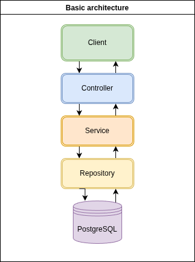
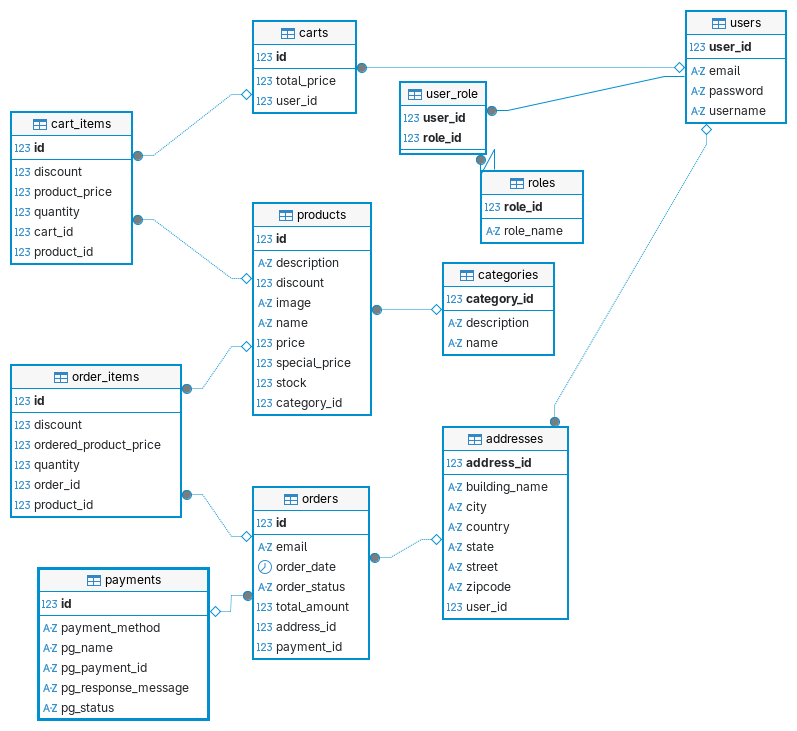

# shop-api

A RESTful e-commerce API built with Spring Boot 3 that enables users to publish products, browse categories, and purchase items.

## Features

- User registration and authentication
- Product catalog
- Product categories
- Shopping cart management
- Order processing
- Order history
- JWT authentication

## Architecture




Technology Stack:

- Java 17
- Spring Boot
- Spring Security
- Spring Data JPA
- PostgreSQL
- Maven

## Project Structure

src/main/java/io/github/gabrielhe4/shop_api

```
├── controller
├── service
├── repository
├── util
├── model
├── mapper
├── dto
├── security
├── config
└── exception
```

## Security

- JWT Authentication
- BCrypt password encryption
- Role-based authorization (USER, ADMIN)

## Database model



## Prequisites

- Java 17
- Maven 3.9+
- PostgreSQL 16
- Docker

Docker installation:
https://docs.docker.com/engine/install/

## Installation

Start the database locally:

For docker:
`docker compose -f compose.dev.yml up -d`

For podman:
`podman compose -f compose.dev.yml up -d`

Clone the repository:

git clone https://github.com/gabrielhe4/shop-api.git

cd shop-api

mvn clean install

mvn spring-boot:run

## Api Documentation

http://localhost:8080/swagger-ui/index.html#/

## Future Improvements

- Microservices migration
- UI development (React, Angular)
- Unit tests
- Founded bugs

## Learning objectives

This project was developed to practice:

- Spring Boot
- Spring Security
- JPA/Hibernate
- REST API Design
- Database Modeling
- JWT Authentication
- Clean Architecture principles